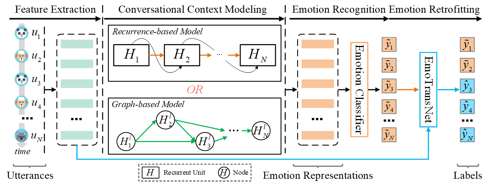

## Requirements

- Python 3.8.0
- PyTorch 1.10.1+cu12.2
- Transformers 4.27.4


The code has been tested on Ubuntu 20.04 using a single RTX 3090 GPU.
<br>
## Constructing EmoTransKG
1. You can download the IEMOCAP and EmoryNLP dataset, extracted utterances we used from: 
[here](https://github.com/declare-lab/conv-emotion/tree/master/COSMIC/feature-extraction)
2. Run:
```bash
python EmoTransNet/EmoTransKG_Construction.py
```
## EmoTransNet: Training EmoTransKG
1. Please download the IEMOCAP and EmoryNLP datasets and put them in the data folder.
And we utilize the codes from [here](https://github.com/declare-lab/conv-emotion/tree/master/COSMIC) to extract utterance or event features.
2. Run our EmoTransNet model:
```bash
python EmoTransNet/EmoTransNet.py --lr 2e-5 --l2 3e-4 --dropout 0.5 --batch_size 64 --transformer_layers 6 --epoches 100
```
## Conversational Emotion Recognition with EmoTransNet
See the [paper](https://aclanthology.org/2024.findings-acl.720/) for more information.
<p align="center">
  
</p>

## Citing EmoTransKG

If you find this repo useful in your research, please consider citing the following papers:

  @inproceedings{zhao2024emotranskg,
  title={EmoTransKG: An Innovative Emotion Knowledge Graph to Reveal Emotion Transformation},
  author={Zhao, Huan and Zha, Xupeng and Zhang, Zixing},
  booktitle={Findings of the Association for Computational Linguistics ACL 2024},
  pages={12098--12110},
  year={2024}
}
